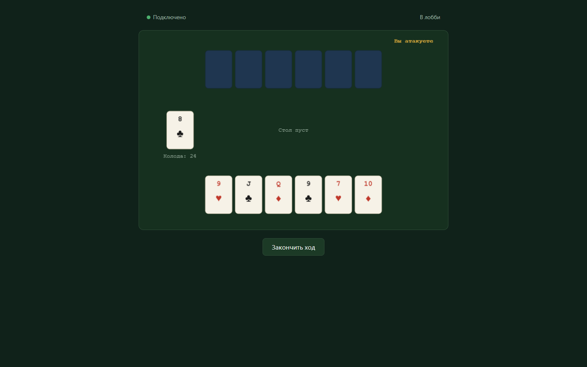

# Mini Multiplayer Game Platform («Дурак»)

**Русский** · [English](README.en.md)

Тестовое задание под вакансию React/TypeScript/Node.js разработчика: каркас
multiplayer-игровой платформы (lobby → matchmaking → комната → игра), где
первая реализованная игра - упрощённый «Дурак» на двух игроков.

Архитектура спроектирована так, чтобы игровая логика (`packages/game-core`)
не зависела от React/Phaser/NestJS/Socket.IO и могла переиспользоваться
вторым клиентом или второй игрой в будущем.

Подробности исходного плана и архитектурных решений:
[plan-testovogo-zadaniya.md](./plan-testovogo-zadaniya.md),
[docs/architecture-research.md](./docs/architecture-research.md). История
использования AI по ходу разработки: [AI_USAGE.md](./AI_USAGE.md).



## Стек

- **`packages/game-core`**: чистая игровая логика и domain-типы, без
  внешних зависимостей (TypeScript + Vitest).
- **`apps/server`**: NestJS + Socket.IO: lobby, matchmaking, комнаты,
  server-authoritative валидация ходов, session/reconnect (Jest + реальный
  `socket.io-client` в integration-тестах).
- **`apps/web`**: Next.js (App Router) + React + Phaser: lobby, игровая
  комната, рендеринг состояния и ввод (Vitest + Testing Library для
  клиентской логики).

## Архитектура

```
Client (Next.js + React + Phaser)
        │  Socket.IO client
        ▼
Socket.IO Gateway (NestJS) — тонкий транспортный слой
        │
        ▼
LobbyService / GameService  ──uses──▶  game-core (чистые функции)
        │
        ▼
In-memory room store (Map<roomId, GameSession>)
```

- **`game-core`** - единственный источник правил игры: `createInitialState`,
  `getValidMoves`, `applyMove`, `toClientView`. Чистые детерминированные
  функции, не мутирующие вход, без сетевых или UI зависимостей.
- **`GameService`/`LobbyService`** держат `GameState` и matchmaking-очередь
  в памяти, вызывают `game-core` для валидации и переходов, управляют
  жизненным циклом комнаты, session-токенами, disconnect/reconnect/forfeit
  таймерами.
- **`GameGateway`** парсит форму входящего payload (zod), резолвит
  socket → player/room, делегирует сервисам, рассылает персональный
  `game_state_update` каждому игроку. Не содержит игровых правил.
- **React/Next.js** владеет Socket.IO-соединением (единый контекст на всё
  приложение), lobby, роутингом, экраном победы/поражения, reconnect UI.
- **Phaser** отвечает только за рендеринг и pointer-ввод: превращает клик по
  карте в `MoveIntent` и рисует то, что прислал сервер. Не хранит собственных
  игровых правил и не принимает решений о легальности хода.

## Server-authoritative и hidden state

- Полный `GameState` существует только на сервере; клиент никогда его не
  получает.
- Клиент отправляет **намерение** (`make_move`), а не state, и сервер решает,
  применять ли его.
- Каждое действие дважды проверяется на легальность: `GameGateway` сверяет
  форму payload (zod-схема), затем `applyMove` в `game-core` независимо
  переповторяет `getValidMoves`, даже если сервис уже отфильтровал ход
  (defense-in-depth).
- `toClientView(state, playerId)` - единственный канал раскрытия состояния:
  свои карты полностью, карты соперника только количеством, порядок
  колоды не раскрывается никогда.
- Оптимистичных обновлений на клиенте нет: Phaser и React перерисовываются
  только по факту `game_state_update`, пришедшего от сервера.

## Matchmaking, reconnect, forfeit

1. `join_queue`: если в очереди уже кто-то ждёт, оба игрока сразу
   получают `match_found` (с `roomId` и персональным `sessionToken`) и
   первый `game_state_update`.
2. При разрыве соединения комната и `GameState` не уничтожаются: игрок
   помечается `disconnected`, второй игрок получает `opponent_disconnected`,
   стартует grace period (90 сек по умолчанию).
3. `reconnect` с валидным `sessionToken` возвращает актуальный персональный
   state; если реконнект случился после реального disconnect, второй игрок
   получает `opponent_reconnected`. Повторное подключение с тем же токеном
   (открытая вторая вкладка) корректно вытесняет старый сокет.
4. Если игрок не вернулся за grace period, а соперник активен, засчитывается форфейт:
   `status` переходит в `finished`, комната закрывается по TTL. Если не
   вернулись оба, комната закрывается без победителя.
5. После закрытия комнаты (по TTL или double-forfeit) сервер полностью
   удаляет её session/socket-записи: сессия по-настоящему перестаёт
   существовать, а не просто становится недостижимой.

## Локальный запуск

Требования: Node.js ≥ 20, pnpm.

```bash
pnpm install
```

Скопировать примеры env-файлов (значения по умолчанию уже подходят для
локальной разработки без правок):

```bash
cp apps/server/.env.example apps/server/.env
cp apps/web/.env.example apps/web/.env.local
```

Запустить сервер и клиент в двух терминалах:

```bash
pnpm --filter @game/server dev    # NestJS + Socket.IO на :3001 (nest start --watch не настроен — см. ниже)
pnpm --filter @game/web dev       # Next.js на :3000
```

> В `apps/server` нет отдельного `dev`-скрипта с watch-режимом. Для
> локальной разработки собрать и запустить: `pnpm --filter @game/server build && pnpm --filter @game/server start`,
> либо `pnpm --filter @game/game-core build && npx ts-node apps/server/src/main.ts`
> при необходимости живой перезагрузки.

Открыть `http://localhost:3000` в двух отдельных вкладках/браузерах (или
инкогнито-окнах, чтобы у каждой был свой `localStorage`). «Найти
соперника» в обеих сведёт их в одну игру.

## Тесты

```bash
pnpm --filter @game/game-core test   # 67 unit/property-тестов правил игры
pnpm --filter @game/server test      # 25 integration-тестов (реальный socket.io-client + NestJS)
pnpm --filter @game/web test         # unit-тесты клиентской логики (session, socket-состояния)
pnpm -r run typecheck                # строгий TypeScript по всем пакетам
pnpm lint                            # ESLint по всему workspace
```

Что покрыто:

- **game-core**: раздача, лимиты подкидывания, все переходы `applyMove`,
  win/draw/незавершённые состояния, hidden state в `toClientView`,
  иммутабельность и целостность колоды (36 карт) на полных симулированных
  партиях с разными сидами.
- **server**: matchmaking (включая гонку одновременного `join_queue` и
  `leave_queue` сразу после матча), server-side валидация каждого типа
  хода и malformed payload, полный disconnect→reconnect→forfeit lifecycle,
  duplicate connection, повторные ходы одного клиента подряд (double
  action), reconnect на грани окончания grace period, и то, что
  session/socket-индексы действительно очищаются после закрытия комнаты
  (а не только помечают её недостижимой).
- **web**: персистентность сессии в `localStorage` (включая повреждённые/
  неполные данные), состояния `SocketProvider` вокруг `match_found`,
  восстановления сессии и ошибок реконнекта (`INVALID_SESSION`/
  `ROOM_NOT_FOUND` корректно очищают сохранённую сессию).

## Известные ограничения MVP

Это тестовое задание на 3-4 дня, а не production-сервис. Осознанно
оставлено за пределами MVP:

- **In-memory state.** Активные комнаты, matchmaking-очередь и
  session-индексы живут только в памяти одного процесса. Рестарт сервера
  теряет все активные игры; несколько инстансов сервера не смогут делить
  состояние без внешнего стора (Redis). Горизонтальное масштабирование не
  реализовано и не требовалось для трёх критических сценариев.
- **Нет аутентификации.** Игрок identifies себя только session-токеном,
  выданным при матче; нет аккаунтов и постоянной identity между визитами.
  Как следствие, один и тот же человек, открыв две вкладки без сохранённой
  сессии, теоретически может встать в очередь сам с собой и попасть в игру
  против самого себя. Это не уязвимость протокола: каждая вкладка
  по-прежнему видит только свою собственную руку через `toClientView`,
  сервер остаётся источником истины в обеих вкладках одинаково. Это просто
  забавный edge case demo-режима без учётных записей, который аутентификация
  решила бы, но её добавление ради одного этого случая было бы избыточным
  усложнением архитектуры.
- **Нет истории партий, Postgres, Redis, Docker Compose.** Не нужны ни
  одному из трёх критических сценариев (matchmaking → игра, отклонение
  нелегального хода, disconnect → reconnect); добавление этих технологий
  «для галочки» увеличило бы площадь для багов без демонстрационной пользы.
- **CORS** ограничен через `CORS_ORIGIN` (по умолчанию
  `http://localhost:3000`). Для реального деплоя достаточно один раз
  задать переменную окружения с адресом фронтенда, инфраструктура (reverse
  proxy, TLS и т.д.) не входит в скоуп.

## Переменные окружения

| Переменная | Где | Назначение | Значение по умолчанию |
|---|---|---|---|
| `PORT` | `apps/server` | Порт, на котором слушает NestJS/Socket.IO сервер | `3001` |
| `CORS_ORIGIN` | `apps/server` | Разрешённый origin(ы) для Socket.IO (через запятую) | `http://localhost:3000` |
| `NEXT_PUBLIC_SERVER_URL` | `apps/web` | URL сервера, к которому подключается клиент | `http://localhost:3001` |

Примеры лежат в `apps/server/.env.example` и `apps/web/.env.example`. Реальные
`.env`/`.env.local` в git не попадают (см. `.gitignore`).
